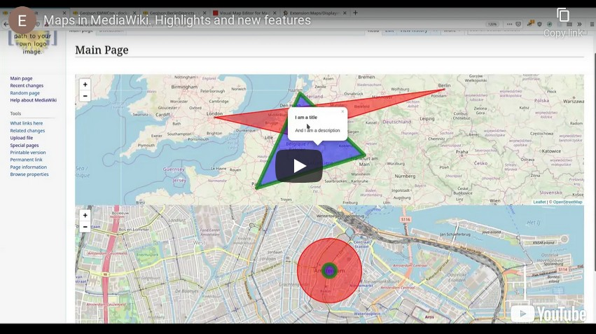

# Maps

Maps is the [MediaWiki](https://www.mediawiki.org) extension to visualize and work with geographical
information. It has been maintained since 2009 and is installed on 1000+ wikis.

Features:

* Customizable and dynamic [Leaflet maps]
* Customizable and dynamic [Google Maps]
* Structured data and query [integration with Semantic MediaWiki]
* [Visual map editor]
* [GeoJSON] and [KML] support
* Parser functions for [geocoding], [coordinate formatting] and geospatial operations
* Translations in over 100 languages, image layers, static maps and [more]

Missing a feature? [Professional.Wiki](https://professional.wiki/) does custom development at a discount if it is open sourced.

## Documentation

### For administrators

* [Installation](https://maps.extension.wiki/wiki/Installation)
* [Configuration](https://maps.extension.wiki/wiki/Configuration)
* [Release notes](RELEASE-NOTES.md) - detailed list of changes per release
* [Platform compatibility](INSTALL.md#platform-compatibility-and-release-status) - overview of PHP and MediaWiki support per release

### For wiki users

* [Feature overview](https://maps.extension.wiki)
* [Displaying Leaflet maps](https://maps.extension.wiki/wiki/Displaying_Leaflet_maps)
* [Customizing Leaflet maps](https://maps.extension.wiki/wiki/Customizing_Leaflet_maps)
* [Displaying Google maps](https://maps.extension.wiki/wiki/Displaying_Google_maps)
* [Customizing Google Maps](https://maps.extension.wiki/wiki/Customizing_Google_Maps)
* [Semantic MediaWiki integration](https://maps.extension.wiki/wiki/Semantic_MediaWiki)

### Getting support

* Professional support and custom development: **[Professional.Wiki](https://professional.wiki/)**
* Ask a question on [the mailing list](https://www.semantic-mediawiki.org/wiki/Mailing_list)
* File an issue on [our issue tracker](https://github.com/JeroenDeDauw/Maps/issues)

## Project status

* Latest version &nbsp;&nbsp;&nbsp;&nbsp;&nbsp;&nbsp;&nbsp;&nbsp;&nbsp;&nbsp;&nbsp;&nbsp;&nbsp;&nbsp;&nbsp;&nbsp;&nbsp;&nbsp; 
* Downloads on [Packagist](https://packagist.org/packages/mediawiki/maps)&nbsp;&nbsp; 
* Continuous integration &nbsp;&nbsp;&nbsp;&nbsp; 
* Code quality &nbsp;&nbsp;&nbsp;&nbsp;&nbsp;&nbsp;&nbsp;&nbsp;&nbsp;&nbsp;&nbsp;&nbsp;&nbsp;&nbsp;&nbsp;&nbsp;&nbsp;&nbsp;&nbsp;&nbsp; 
* [Open bugs and feature requests](https://github.com/JeroenDeDauw/Maps/issues)
* [Maps on OpenHub](https://www.openhub.net/p/maps/)
* [Blog posts about Maps](https://www.entropywins.wtf/blog/tag/maps/)

## Contributing

* [File an issue](https://github.com/JeroenDeDauw/Maps/issues)
* [Submit a pull request](https://github.com/JeroenDeDauw/Maps/pulls) ([tasks for newcomers](https://github.com/JeroenDeDauw/Maps/issues?q=is%3Aissue+is%3Aopen+label%3Anewcomer))

### Project structure

The `src/` contains the PHP code and follows PSR-4 autoloading.

* `src/Map` - Map display entry points (such as handling of `#display_map`) and their supporting code
* `src/ParserHooks` - Entry points for all parser hooks except `#display_map`
* `src/Presentation` - Presentation layer code that does not belong to a more specific directory
* `src/DataAccess` - Persistence layer code that does not belong to a more specific directory
* `src/GeoJsonPages` - Code that deals with pages in the GeoJson namespace
* `src/LegacyModel` - Badly designed and deprecated representations of map elements (markers, polygons, etc)
* `src/LegacyMapEditor` - Deprecated and Google Maps only Special:MapEditor page
* `src/SemanticMW` - Semantic MediaWiki code except for the map entry point (which is in `Map\SemanticFormat`)
* `src/WikitextParsers` - Parsers for the wikitext definitions of map elements (like the `LegacyModel`)

JavaScript, CSS and other web resources go into `resources/`.

Tests for PHP go into `tests/` where they are grouped by test type (ie unit, integration). Within those test type
directories the tests should mirror the directory structure in `src/`.

### Running the tests

As setup, run `composer install` inside of the Maps root directory.

You can run the MediaWiki independent tests by executing phpunit in the root directory of maps:

    phpunit

This is possible without having a MediaWiki installation or webserver. A clone of the Maps code suffices.

If you do not have PHPUnit installed, you can download the .phar into the root directory and execute it there:

	wget -O phpunit.phar https://phar.phpunit.de/phpunit-7.phar
	php phpunit.phar

To run the tests with MediaWiki, change into `tests/phpunit` of your MediaWiki installation and run

    php phpunit.php --wiki wiki -c ../../extensions/Maps/phpunit.xml.dist
    
Where you either update `wiki` to match your wikis name, or drop the parameter. The above command
works without modification if you are using the [MediaWiki Vagrant](https://www.mediawiki.org/wiki/MediaWiki-Vagrant).

Beware that due to technical debt, some tests access the network.

## Links

* [Maps documentation wiki](https://maps.extension.wiki)
* [Maps on OpenHub](https://www.openhub.net/p/maps/)
* [Maps on Packagist](https://packagist.org/packages/mediawiki/maps)
* [Maps on WikiApiary](https://wikiapiary.com/wiki/Extension:Maps)
* [Maps on MediaWiki.org](https://www.mediawiki.org/wiki/Extension:Maps)
* [Sponsor Maps development](https://github.com/sponsors/JeroenDeDauw)

[Leaflet maps]: https://maps.extension.wiki/wiki/Displaying_Leaflet_maps
[Google Maps]: https://maps.extension.wiki/wiki/Displaying_Google_Maps
[integration with Semantic MediaWiki]: https://maps.extension.wiki/wiki/Semantic_MediaWiki
[Visual map editor]: https://maps.extension.wiki/wiki/Visual_editing
[GeoJSON]: https://maps.extension.wiki/wiki/GeoJSON
[KML]: https://maps.extension.wiki/wiki/KML
[geocoding]: https://maps.extension.wiki/wiki/Geocoding
[coordinate formatting]: https://maps.extension.wiki/wiki/Coordinates_function
[more]: https://maps.extension.wiki/wiki/Maps_for_MediaWiki
